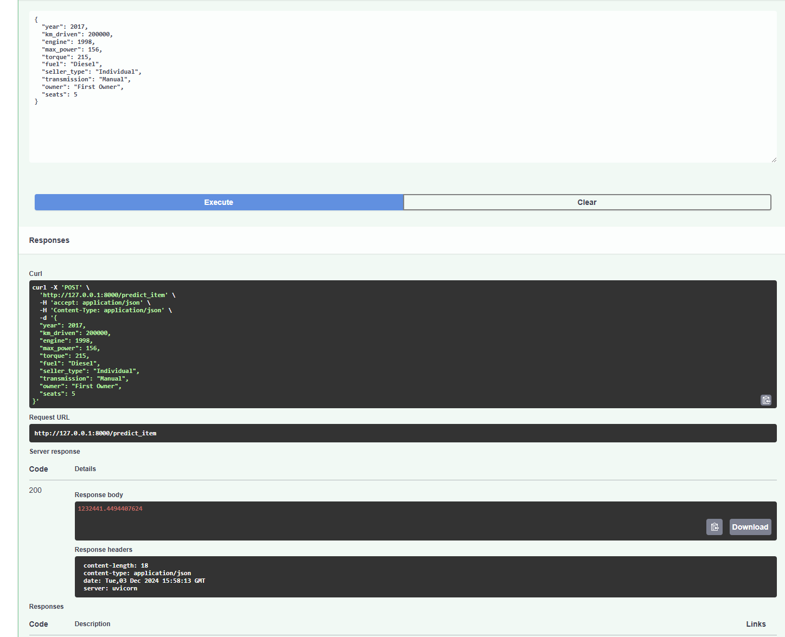
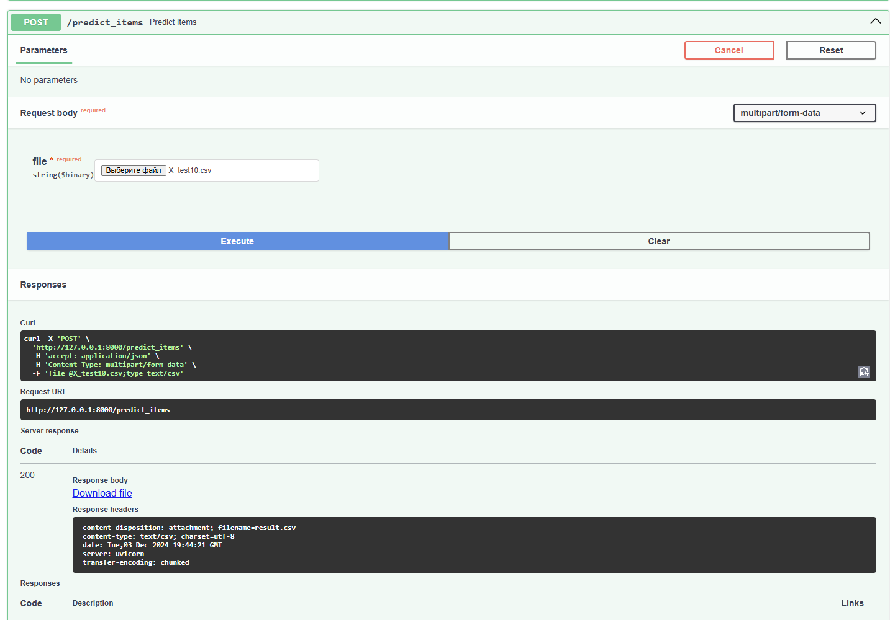

# ml

1. Все задания были выполнены за исключением  L0-регуляризации и Feature Engineering.
2. Лучшее качество дала модель - Ridge регрессия с параметрами, подобранными с GridSearchCV и всеми категориальными признаками, преобразованными OHE.
3. В данном репозитории лежат: ноутбук, скрипт сервиса, pickle файл с весами, md файл и скрины работы сервиса.
4. Ниже прикладываю скрины работающего FastAPI сервиса

